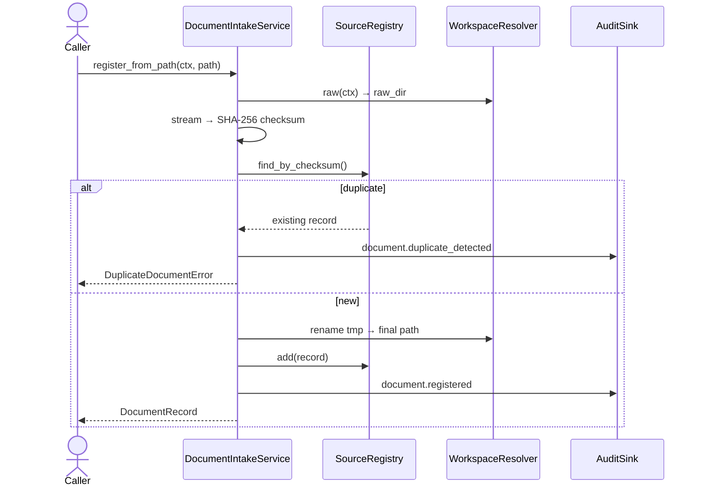
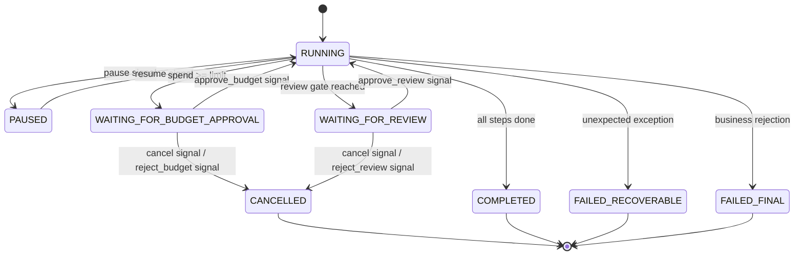

# CLAUDE.md

> **Persistent working context for Claude Code.**
> This file reflects the repository as of commit history through May 2026.
> Update this file whenever architecture, workflows, or key contracts change.

---

## 1. Repository Purpose

**J1** is a reusable, domain-agnostic knowledge intelligence framework for ingesting, processing, structuring, and querying document-based knowledge.

### Problem it solves

Many applications need to ingest heterogeneous documents (PDFs, Markdown, JSON, text, etc.), extract structured knowledge from them, build relational graphs over that knowledge, make it searchable, and then answer natural-language questions against the resulting knowledge base. J1 provides the pipeline infrastructure to do this without binding callers to a specific domain, a specific LLM vendor, or a specific processing technology.

### Type of system

J1 is a Python library (`pip install j1`) and an orchestration substrate. It is **not** a web application, CLI tool, or SaaS product — it is a framework that application authors wire together to build those things. It exposes:

- Core processing protocols (interfaces) that can be implemented by any provider
- Concrete workflow orchestration via **Temporal** (durable, resumable)
- File-system-based persistence with pluggable registries
- A SQLite full-text search index
- A profile system for domain customisation without touching core code

### Expected usage pattern

1. Implement one or more processing adapters (`KnowledgeCompiler`, `EnrichmentProcessor`, `GraphBuilder`, `SearchIndexer`, `QueryProvider`) or use the built-in connector wrappers.
2. Instantiate `ProcessingService`, `DocumentIntakeService`, and the activity classes.
3. Register activities and workflows with a Temporal worker via `build_worker`.
4. Trigger workflows (`ProjectProcessingWorkflow`, `DocumentProcessingWorkflow`) to process document collections.
5. Query results via `HybridQueryEngine` or the `SqliteSearchIndexer` directly.

### Relationship between subsystems

```
Documents → Intake → (raw storage)
                         ↓
                    Compilation → (compiled artifacts)
                         ↓
                    Enrichment → (enriched artifacts)
                         ↓
                   Graph Build → (graph artifacts)
                         ↓
                    Indexing  → (SQLite FTS index)
                         ↓
                     Query    → HybridQueryEngine → QueryResponse
```

All steps are mediated by Temporal activities and workflows; each step is audited and cost-tracked.

---

## 2. Current System Snapshot

### Implemented

- **Document intake** — SHA-256 deduplication, atomic file storage, JSON registry (`JsonSourceRegistry`), full audit trail
- **Processing service** — compile / enrich / build_graph / index / query with audit and cost recording
- **Connector framework** — `ExternalKnowledgeCompiler` and `ExternalGraphBuilder` that delegate to subprocess or callable adapters
- **Enrichers** — 9 built-in `_StructuredEnricher` subclasses (scaffold implementations; all return empty structured output by default — **no LLM calls are wired in yet**)
- **Artifact registry** — JSON-backed registry with content-hash deduplication (`JsonArtifactRegistry`)
- **Search index** — SQLite FTS5 full-text search (`SqliteSearchIndexer`) with BM25 ranking
- **Query engine** — `HybridQueryEngine` with 5 modes: `KNOWLEDGE_FIRST`, `GRAPH_FIRST`, `EVIDENCE_FIRST`, `CONSISTENCY_CHECK`, `REPORT_GENERATION`; keyword-based intent classifier
- **Temporal integration** — worker, client, retry policies, workflow status mapping
- **Two Temporal workflows** — `ProjectProcessingWorkflow` (full pipeline with signals, gates, budget approval, review gates, pause/resume/cancel) and `DocumentProcessingWorkflow` (single-document, simpler)
- **Activity classes** — `ProcessingActivities`, `ProjectActivities`, `ProjectLifecycleActivities`, `KnowledgeProcessingActivities`, `SearchActivities`, `ReviewActivities`, `AccountingActivities`
- **Profile system** — `ProfileLoader` with file-system search paths; bundled `default` profile (empty taxonomy, empty routing rules)
- **Audit system** — `AuditRecorder`/`AuditSink` protocols with JSONL file implementation
- **Cost system** — `CostRecorder`/`CostSink` protocols with JSONL file implementation; budget gate in workflow
- **Review queue** — `ReviewQueue` protocol with JSON file implementation; review gate in workflow
- **Workspace layout** — deterministic path resolver with path-traversal protection; areas: `raw`, `compiled`, `enriched`, `graph`, `search`, `audit`, `runtime`
- **Error hierarchy** — structured exceptions rooted at `J1Error`
- **440 passing tests** — full coverage of all modules listed above

### Partially implemented

- **Enrichers** — the 9 enricher classes exist with full scaffolding, but `_produce()` implementations return empty stubs (no LLM invocations, no parsing logic). The `ModelProvider` protocol and `content_source` injection points are defined but callers must wire them.
- **Graph query provider** — reads `graph_json` artifacts and extracts edges; works for well-formed JSON graphs but has no graph traversal algorithm (BFS/DFS) — just scans edge lists up to a small limit.
- **Report generator** — template rendering uses naive `{{question}}` / `{{artifacts}}` substitution; no Jinja2 or structured template engine.
- **Query classifier** — keyword-based only; no embedding-based or LLM-based intent routing.

### Intended but not yet implemented

- **LLM provider integrations** — no concrete `ModelProvider` implementations exist in the repo (no OpenAI, MiniMax, DashScope, Qwen, or any other provider). The protocol is defined; implementations must be added.
- **Vector search / embedding** — no embedding pipeline, no vector database. All search is SQLite FTS5.
- **REST API / HTTP server** — no FastAPI, Flask, or any HTTP layer. The framework is library-only.
- **CLI entrypoint** — no `__main__` or CLI commands.
- **MCP / tool protocol** — not implemented.
- **Webhook support** — not implemented.
- **JobRecord persistence** — `JobRecord` model is defined in `j1/jobs/models.py` but there is no `JobRegistry` or persistence layer for it.
- **Multi-modal (vision/audio)** — not implemented.

### Known limitations

- All registries (`JsonSourceRegistry`, `JsonArtifactRegistry`, `JsonReviewQueue`) use flat JSON files. No concurrent write safety (no locking). Suitable for single-writer use.
- Audit and cost logs are append-only JSONL files; no query capability beyond full scan.
- `compute_spend` in `ProjectActivities` performs a full JSONL scan on every budget checkpoint.
- Enricher `_produce()` methods are stubs — they will not fail but they will not produce useful output without overriding or implementing `ModelProvider`.
- SQLite FTS5 must be available in the Python build; `_ensure_fts5_available()` raises `SearchIndexerError` at construction time if missing.
- `WorkspaceResolver` expects an absolute `data_root`; will raise `ConfigError` if relative.

---

## 3. Architecture Overview

### High-level component diagram

```mermaid
graph TD
    subgraph Core
        intake[DocumentIntakeService]
        proc[ProcessingService]
        query[HybridQueryEngine]
        search[SqliteSearchIndexer]
    end

    subgraph Contracts
        KC[KnowledgeCompiler]
        EP[EnrichmentProcessor]
        GB[GraphBuilder]
        SI[SearchIndexer]
        QP[QueryProvider]
        MP[ModelProvider]
    end

    subgraph Connectors
        EKC[ExternalKnowledgeCompiler]
        EGB[ExternalGraphBuilder]
        adapters[CallableAdapter / SubprocessAdapter]
    end

    subgraph Orchestration
        PPW[ProjectProcessingWorkflow]
        DPW[DocumentProcessingWorkflow]
        PA[ProcessingActivities]
        PLA[ProjectLifecycleActivities]
        KPA[KnowledgeProcessingActivities]
        SA[SearchActivities]
        RA[ReviewActivities]
        AA[AccountingActivities]
        TW[Temporal Worker]
    end

    subgraph Storage
        WS[WorkspaceResolver]
        SR[SourceRegistry / JsonSourceRegistry]
        AR[ArtifactRegistry / JsonArtifactRegistry]
        RQ[ReviewQueue / JsonReviewQueue]
        AU[AuditSink / JsonlAuditSink]
        CS[CostSink / JsonlCostSink]
        IDX[(SQLite FTS5)]
    end

    subgraph Profiles
        PL[ProfileLoader]
        PR[Profile]
    end

    intake --> SR
    intake --> WS
    intake --> AU
    proc --> AR
    proc --> AU
    proc --> CS
    proc --> KC
    proc --> EP
    proc --> GB
    proc --> SI
    proc --> QP
    EKC --> KC
    EGB --> GB
    EKC --> adapters
    EGB --> adapters
    PA --> proc
    PLA --> intake
    KPA --> proc
    SA --> SI
    RA --> RQ
    AA --> CS
    AA --> AU
    PPW --> PA
    PPW --> PLA
    DPW --> PA
    TW --> PPW
    TW --> DPW
    search --> IDX
    search --> AR
    query --> search
    query --> AR
    query --> WS
    EGB --> PL
    EGB --> PR
```



### Ingestion workflow



### ProjectProcessingWorkflow state machine



---

## 4. Repository Structure

```text
/
├── pyproject.toml          Project metadata, dependencies, build config
├── src/j1/                 All library source code
└── tests/                  All tests (pytest)
```

### `src/j1/`

```text
src/j1/
├── __init__.py             Single flat public API — re-exports everything
├── _serialization.py       to_jsonable() helper (dataclasses → dicts for JSON)
├── _validators.py          validate_identifier() for tenant/project IDs
│
├── config/
│   └── settings.py         Settings(data_root), load_settings() from J1_DATA_ROOT env var
│
├── workspace/
│   ├── layout.py           WorkspaceArea enum (raw/compiled/enriched/graph/search/audit/runtime)
│   └── resolver.py         WorkspaceResolver — path resolution with traversal guard
│
├── projects/
│   └── context.py          ProjectContext(tenant_id, project_id, profile)
│
├── documents/
│   └── models.py           DocumentRecord, SourceDocument
│
├── artifacts/
│   ├── models.py           ArtifactRecord
│   └── registry.py         ArtifactRegistry protocol + JsonArtifactRegistry
│
├── jobs/
│   ├── models.py           JobRecord (model defined; no registry yet)
│   └── status.py           ProcessingStatus, ReviewStatus enums
│
├── intake/
│   ├── registry.py         SourceRegistry protocol + JsonSourceRegistry
│   └── service.py          DocumentIntakeService (register_from_path, register_from_stream)
│
├── processing/
│   ├── contracts.py        KnowledgeCompiler, EnrichmentProcessor, GraphBuilder,
│   │                       SearchIndexer, QueryProvider, ModelProvider protocols
│   ├── results.py          ArtifactDraft, ArtifactProcessingResult, QueryResult,
│   │                       ProcessingResult, ModelResponse, ReviewItemResult
│   ├── service.py          ProcessingService (compile/enrich/build_graph/index/query)
│   └── status.py           ResultStatus enum
│
├── enrichers.py            9 built-in _StructuredEnricher subclasses + GENERIC_ENRICHERS
│
├── connectors/
│   ├── compiler/
│   │   ├── adapters.py     CompilerAdapter protocol, CallableCompilerAdapter,
│   │   │                   SubprocessCompilerAdapter, AdapterRequest/Response
│   │   ├── config.py       CompilerConfig, artifact kind constants, DEFAULT_OUTPUT_MAPPING
│   │   └── connector.py    ExternalKnowledgeCompiler (implements KnowledgeCompiler)
│   └── graph/
│       ├── adapters.py     GraphAdapter protocol, CallableGraphAdapter,
│       │                   SubprocessGraphAdapter, GraphAdapterRequest/Response
│       ├── config.py       GraphConfig, graph artifact kind constants
│       └── connector.py    ExternalGraphBuilder (implements GraphBuilder)
│
├── search/
│   └── indexer.py          SqliteSearchIndexer (FTS5), SearchHit
│
├── query/
│   ├── classifier.py       QueryIntentClassifier (keyword-based)
│   ├── engine.py           HybridQueryEngine (AUTO routing + fallback)
│   ├── models.py           QueryMode, QueryRequest, QueryResponse, SourceReference, GraphPath
│   └── providers.py        KnowledgeQueryProvider, GraphQueryProvider, EvidenceProvider,
│                           ConsistencyProvider, ReportGenerator
│
├── profiles/
│   ├── loader.py           ProfileLoader, bundled_profiles_dir()
│   ├── model.py            Profile dataclass
│   └── default/            Bundled default profile
│       ├── profile.yaml
│       ├── graph_taxonomy.yaml    (empty: node_types: [], edge_types: [])
│       ├── query_routing.yaml     (empty: routes: [])
│       ├── review_rules.yaml      (empty: rules: [])
│       ├── prompts/extract.md     (stub prompt template)
│       ├── schemas/artifact.json  (generic artifact schema)
│       └── report_templates/default.md  ({{question}}/{{artifacts}} template)
│
├── audit/
│   ├── events.py           AuditEvent dataclass
│   ├── recorder.py         AuditRecorder protocol + DefaultAuditRecorder
│   └── sink.py             AuditSink protocol + JsonlAuditSink → events.jsonl
│
├── cost/
│   ├── breakdown.py        CostBreakdown, CostResult
│   ├── events.py           CostEvent dataclass
│   ├── recorder.py         CostRecorder protocol + DefaultCostRecorder
│   └── sink.py             CostSink protocol + JsonlCostSink → costs.jsonl
│
├── review/
│   ├── models.py           ReviewItem dataclass
│   └── queue.py            ReviewQueue protocol + JsonReviewQueue → review_items.json
│
├── errors/
│   └── exceptions.py       Full error hierarchy rooted at J1Error
│
├── orchestration/
│   ├── activities/
│   │   ├── payloads.py     All Temporal-serialisable input/output dataclasses
│   │   ├── processing.py   ProcessingActivities (compile/enrich/build_graph/index/query)
│   │   ├── project.py      ProjectActivities (validate_context/list_pending/compute_spend/finalize)
│   │   ├── lifecycle.py    ProjectLifecycleActivities (validate/prepare_workspace/register_docs/finalize)
│   │   ├── knowledge.py    KnowledgeProcessingActivities (run_compilation/register/enrich/graph)
│   │   ├── search.py       SearchActivities (build_search_index)
│   │   ├── review.py       ReviewActivities (create_review_items)
│   │   └── accounting.py   AccountingActivities (calculate_cost/write_audit)
│   ├── workflows/
│   │   ├── project_processing.py   ProjectProcessingWorkflow (full pipeline + signals)
│   │   └── document_processing.py  DocumentProcessingWorkflow (single document)
│   └── temporal/
│       ├── client.py       build_client(settings) → temporalio.client.Client
│       ├── config.py       TemporalSettings, load_temporal_settings()
│       ├── retries.py      RetryPolicySpec, DEFAULT_RETRY
│       ├── status.py       map_workflow_status() Temporal → ProcessingStatus
│       └── worker.py       WorkerSpec, build_worker(), run_worker()
│
└── logging/
    └── setup.py            Minimal logging configuration helper
```

**What belongs in `src/j1/`:** Core protocol definitions, concrete generic implementations, framework orchestration. No domain-specific logic.

**What does NOT belong here:** LLM provider implementations, domain ontologies, REST handlers, CLI code, configuration for specific deployment environments.

---

## 5. Core Concepts and Terminology

| Term | Definition |
|---|---|
| **ProjectContext** | Immutable (`tenant_id`, `project_id`, `profile`) triple that scopes all data. All operations are per-project. |
| **DocumentRecord** | Metadata for a raw ingested file. Stored in `SourceRegistry`. Contains checksum, MIME, path, status. |
| **ArtifactRecord** | Metadata for a produced output (compiled, enriched, graph, etc.). Stored in `ArtifactRegistry`. Has `kind`, `location`, `content_hash`. |
| **ArtifactDraft** | In-flight artifact not yet persisted. Returned from compiler/enricher/graph builder. `ProcessingService` materialises it to disk and creates an `ArtifactRecord`. |
| **Kind** | String tag on an artifact that identifies its type (e.g. `compiled_index`, `enriched.requirements`, `graph_json`). Used for filtering and routing. |
| **KnowledgeCompiler** | Protocol: converts a raw document into compiled artifacts. Implemented by `ExternalKnowledgeCompiler`. |
| **EnrichmentProcessor** | Protocol: transforms a compiled artifact into enriched artifacts. Implemented by `_StructuredEnricher` subclasses. |
| **GraphBuilder** | Protocol: takes a set of artifact IDs and builds a graph artifact. Implemented by `ExternalGraphBuilder`. |
| **SearchIndexer** | Protocol: indexes a set of artifact IDs into a searchable store. Implemented by `SqliteSearchIndexer`. |
| **QueryProvider** | Protocol: answers a question given a `ProjectContext`. Five built-in providers. |
| **ModelProvider** | Protocol: calls an LLM for a completion. No concrete implementation provided in this repo. |
| **Adapter** | Bridges between the framework's connector contract and an external tool or subprocess. `CallableCompilerAdapter`, `SubprocessCompilerAdapter`, etc. |
| **Profile** | A named directory of configuration files (prompts, schemas, taxonomy, routing rules, report templates). Loaded by `ProfileLoader`. |
| **WorkspaceArea** | One of seven filesystem subdirectories under a project root: `raw`, `compiled`, `enriched`, `graph`, `search`, `audit`, `runtime`. |
| **WorkspaceResolver** | Maps `(ProjectContext, WorkspaceArea)` to absolute filesystem paths. Guards against path traversal. |
| **SourceRegistry** | Stores and retrieves `DocumentRecord` objects. Default implementation: JSON file. |
| **ArtifactRegistry** | Stores and retrieves `ArtifactRecord` objects. Default implementation: JSON file. |
| **ReviewQueue** | Stores `ReviewItem` objects pending human review. Default implementation: JSON file. |
| **AuditSink** | Append-only sink for `AuditEvent` objects. Default: JSONL file. |
| **CostSink** | Append-only sink for `CostEvent` objects. Default: JSONL file. |
| **ProjectScope** | Temporal-serialisable equivalent of `ProjectContext`. Converts to/from `ProjectContext`. |
| **ProcessingActivities** | Temporal activity class that runs compile/enrich/build_graph/index/query by dispatching to registered processors. |
| **ProjectProcessingWorkflow** | Full Temporal workflow: validates → lists docs → compiles → enriches → builds graph → indexes → finalizes. Supports pause, resume, cancel, budget gates, review gates. |
| **DocumentProcessingWorkflow** | Simplified single-document Temporal workflow: compile → enrich → index. |
| **WorkflowState** | Enum tracking the current state of `ProjectProcessingWorkflow`: `RUNNING`, `PAUSED`, `WAITING_FOR_BUDGET_APPROVAL`, `WAITING_FOR_REVIEW`, `COMPLETED`, `CANCELLED`, `FAILED_RECOVERABLE`, `FAILED_FINAL`. |
| **Gate** | A named pause point in the workflow where human approval is required before proceeding. Gates: `GATE_AFTER_COMPILE`, `GATE_AFTER_ENRICH`, `GATE_AFTER_GRAPH`, `GATE_AFTER_INDEX`. |
| **HybridQueryEngine** | Orchestrates multiple `QueryProvider` instances; classifies query intent in `AUTO` mode and falls back from `KNOWLEDGE_FIRST` to `GRAPH_FIRST` when no sources are found. |
| **QueryMode** | `AUTO`, `KNOWLEDGE_FIRST`, `GRAPH_FIRST`, `EVIDENCE_FIRST`, `CONSISTENCY_CHECK`, `REPORT_GENERATION`. |
| **SearchHit** | Result from `SqliteSearchIndexer.search()`. Contains artifact metadata and BM25 score. |

---

## 6. Main Workflows

### 6.1 Document Upload / Input

**Entry points:**
- `DocumentIntakeService.register_from_path(ctx, path)` — for files already on disk
- `DocumentIntakeService.register_from_stream(ctx, stream, original_filename=...)` — for streaming upload

**Process:**
1. Content is streamed into a temp file inside the `raw` workspace area (same filesystem as final destination — ensures atomic rename).
2. SHA-256 checksum is computed during streaming.
3. `SourceRegistry.find_by_checksum()` is called — if a match exists, the temp file is deleted and `DuplicateDocumentError` is raised.
4. The temp file is renamed to `{document_id}{ext}` (atomic).
5. A `DocumentRecord` is created with `status=PENDING` and added to `SourceRegistry`.
6. An `AuditEvent` (`document.registered`) is written.

**Validation:**
- `original_filename` is required for stream uploads.
- Source path must be an existing file for path-based uploads.
- `tenant_id` and `project_id` must be valid identifiers (alphanumeric + underscore + hyphen, non-empty).

**Storage:**
- Raw file: `{data_root}/tenants/{tenant_id}/projects/{project_id}/raw/{document_id}{ext}`
- Registry: `{data_root}/tenants/{tenant_id}/projects/{project_id}/runtime/documents.json`

---

### 6.2 Ingestion Workflow (via Temporal)

**Triggered by:** Starting a `ProjectProcessingWorkflow` or `DocumentProcessingWorkflow`.

**`ProjectLifecycleActivities` sequence:**
1. `validate_project_activity` — validates the `ProjectScope`, writes audit event.
2. `prepare_workspace_activity` — calls `WorkspaceResolver.ensure()` to create all workspace directories.
3. `register_documents_activity` — iterates a list of `DocumentSource` specs, calls `DocumentIntakeService.register_from_path()` for each. Duplicates are skipped (not errors). Errors are accumulated and returned as `partial` status.

**Output:** List of registered `document_id` strings. Documents with `status=PENDING` are eligible for processing.

---

### 6.3 Knowledge Processing Workflow

**Compilation** (`KnowledgeProcessingActivities.run_knowledge_compilation_activity`):
1. Looks up the document in `SourceRegistry`.
2. Calls `KnowledgeCompiler.compile(ctx, document_id)`.
3. Records cost events, writes audit event.
4. Returns `KnowledgeCompilationResult` with `DraftPayload` list.

**Artifact registration** (`register_compiled_artifacts_activity`):
1. For each draft, computes SHA-256 content hash.
2. If an artifact with the same hash already exists, reuses it (deduplication).
3. Otherwise materialises draft to disk (in `compiled/` area) and creates `ArtifactRecord`.
4. Returns list of new + reused artifact IDs.

**Enrichment** (`run_artifact_enrichment_activity`):
1. Looks up artifact in `ArtifactRegistry`.
2. Calls `EnrichmentProcessor.enrich(ctx, artifact_id)`.
3. Materialises resulting drafts to `enriched/` area.
4. Records cost events, writes audit event.

**Graph build** (`run_graph_build_activity`, `register_graph_artifacts_activity`):
1. Prepares corpus: filters artifacts by kind (`prepare_graph_corpus_activity`).
2. Copies artifact content to a temp corpus directory.
3. Calls `GraphBuilder.build(ctx, artifact_ids)`.
4. Materialises graph outputs to `graph/` area.

**Note:** The built-in enricher `_produce()` methods are stubs. Without a real `ModelProvider` and overriding `_produce()`, enrichment produces empty-content artifacts.

---

### 6.4 Retrieval / Query Workflow

**Entry point:** `HybridQueryEngine.query(ctx, QueryRequest)`.

**Mode selection:**
- `AUTO`: `QueryIntentClassifier.classify(question)` matches keywords to `QueryMode` (first match wins). Falls back to `KNOWLEDGE_FIRST`. If `KNOWLEDGE_FIRST` returns no sources, `GRAPH_FIRST` is tried and results are merged.
- Explicit mode: classifier is bypassed.

**Provider dispatch:**

| Mode | Provider | Mechanism |
|---|---|---|
| `KNOWLEDGE_FIRST` | `KnowledgeQueryProvider` | SQLite FTS5 BM25 search |
| `GRAPH_FIRST` | `GraphQueryProvider` | Reads `graph_json` artifacts, extracts edges |
| `EVIDENCE_FIRST` | `EvidenceProvider` | FTS5 search + source document verification |
| `CONSISTENCY_CHECK` | `ConsistencyProvider` | Reads `enriched.consistency_findings` artifacts |
| `REPORT_GENERATION` | `ReportGenerator` | Lists indexed artifacts; applies profile template |

**Response:** `QueryResponse(answer, mode_used, sources, graph_paths, confidence, review_required, warnings)`.

**Limitations:**
- `GraphQueryProvider` scans edge lists — no BFS/DFS, no path finding algorithm.
- `KnowledgeQueryProvider` composes answer by concatenating text snippets (no LLM synthesis).
- `ReportGenerator` uses naive `{{question}}`/`{{artifacts}}` substitution (no Jinja2).

---

### 6.5 External Communication Workflow

**No HTTP API, REST, webhooks, MCP, or CLI are currently implemented.**

The only external integration surfaces are:
- **Subprocess adapters** (`SubprocessCompilerAdapter`, `SubprocessGraphAdapter`) — invoke external binaries with `{input}`, `{outdir}`, `{document_id}`, `{corpus_dir}`, `{cache_dir}` substitutions.
- **Callable adapters** (`CallableCompilerAdapter`, `CallableGraphAdapter`) — accept a Python callable, useful for in-process integration or testing.
- **Temporal client** (`build_client`) — connects to a Temporal server for workflow management.

When adding an HTTP layer, it must remain outside `src/j1/` core or in a clearly separated sub-package.

---

### 6.6 Worker / Long-running Job Workflow

**Temporal worker setup:**
```python
settings = load_temporal_settings()          # reads J1_TEMPORAL_* env vars
client = await build_client(settings)        # connects to Temporal
spec = WorkerSpec(
    workflows=[ProjectProcessingWorkflow, DocumentProcessingWorkflow],
    activities=[*processing_activities.all_activities(), ...],
)
await run_worker(client, settings, spec)
```

**Job creation:** Start a workflow via the Temporal client:
```python
await client.start_workflow(
    ProjectProcessingWorkflow.run,
    ProjectProcessingRequest(scope=..., compiler_kind=..., ...),
    id="my-workflow-id",
    task_queue=settings.task_queue,
)
```

**Job status:** Query via Temporal `get_status` query or `map_workflow_status()` on the execution status.

**Signals available on `ProjectProcessingWorkflow`:**
- `pause` / `resume` — suspends/resumes before the next expensive operation
- `cancel` — terminates gracefully after current activity
- `approve_budget` / `reject_budget` — resolves a budget gate
- `approve_review` / `reject_review` — resolves a review gate

**Retry policy:** `DEFAULT_RETRY = RetryPolicySpec(initial=1s, backoff=2.0, max_interval=60s, max_attempts=5)`. Configurable per-activity.

**Non-retryable errors:** `DocumentNotFoundError` and unknown processor kinds raise Temporal `ApplicationError(non_retryable=True)`.

**Idempotency:**
- Artifact registration deduplicates by SHA-256 content hash.
- Document intake deduplicates by SHA-256 file hash.
- Neither the workflow nor activities use Temporal's idempotency tokens beyond what Temporal provides by default.

**`JobRecord` model** exists in `j1/jobs/models.py` but there is no registry or persistence for it. It is **not yet integrated**.

---

## 7. Provider and Adapter Design

### Protocol-based design

All processing capabilities are expressed as Python `Protocol` classes in `j1/processing/contracts.py`. Callers depend on protocols, not concrete types.

```
KnowledgeCompiler   .compile(ctx, document_id) → ArtifactProcessingResult
EnrichmentProcessor .enrich(ctx, artifact_id)  → ArtifactProcessingResult
GraphBuilder        .build(ctx, artifact_ids)  → ArtifactProcessingResult
SearchIndexer       .index(ctx, artifact_ids)  → ProcessingResult
QueryProvider       .query(ctx, question, ...)  → QueryResult
ModelProvider       .complete(ctx, prompt, ...) → ModelResponse
```

All have a `kind: str` attribute used as a registry key in activity classes.

### Concrete implementations in this repo

| Protocol | Implementation | Location |
|---|---|---|
| `KnowledgeCompiler` | `ExternalKnowledgeCompiler` | `connectors/compiler/connector.py` |
| `GraphBuilder` | `ExternalGraphBuilder` | `connectors/graph/connector.py` |
| `EnrichmentProcessor` | All 9 `_StructuredEnricher` subclasses | `enrichers.py` |
| `SearchIndexer` | `SqliteSearchIndexer` | `search/indexer.py` |
| `QueryProvider` | 5 providers in `HybridQueryEngine` | `query/providers.py` |
| `ModelProvider` | **None** | — |

### Connector adapter design

Both `ExternalKnowledgeCompiler` and `ExternalGraphBuilder` follow the same pattern:
1. Accept an `Adapter` protocol instance at construction time.
2. Two built-in adapters per connector: `Callable*Adapter` (in-process) and `Subprocess*Adapter` (external binary).
3. Communication is file-based: input files are passed via temp directory; output files are read from temp directory; output filenames are mapped to artifact kinds via `output_mapping` config.
4. Neither connector performs LLM calls — that responsibility belongs to the external process or the callable.

### Adding a new provider

1. Implement the relevant protocol (e.g. `ModelProvider`).
2. Assign a unique `kind` string.
3. Register it in the appropriate `Mapping[str, T]` passed to the relevant activity class constructor.
4. No changes needed to the framework core.

**Do not** add provider-specific code to `processing/contracts.py`, `processing/service.py`, or any workflow/activity.

---

## 8. Configuration and Environment Variables

| Variable | Purpose | Required | Default | Notes |
|---|---|---|---|---|
| `J1_DATA_ROOT` | Absolute path to the root data directory | No | `/data/j1` | Must be absolute; all workspace paths derive from this |
| `J1_TEMPORAL_TARGET` | Temporal server address (`host:port`) | No | `localhost:7233` | |
| `J1_TEMPORAL_NAMESPACE` | Temporal namespace | No | `default` | |
| `J1_TEMPORAL_TASK_QUEUE` | Temporal task queue name | No | `j1-default` | Must match between worker and workflow starter |
| `J1_TEMPORAL_TLS` | Enable TLS for Temporal connection | No | `false` | Accepts: `1`, `true`, `yes`, `on` |
| `J1_TEMPORAL_API_KEY` | API key for Temporal Cloud | No | — | Keep secret; do not commit |

**No other environment variables are currently read by the framework.**

### Loading config

```python
from j1 import Settings, load_settings, TemporalSettings, load_temporal_settings

settings = load_settings()                    # reads J1_DATA_ROOT
temporal = load_temporal_settings()           # reads J1_TEMPORAL_* vars
# Or inject a custom env mapping:
settings = load_settings(env={"J1_DATA_ROOT": "/tmp/j1"})
```

---

## 9. Storage and Persistence

### File layout on disk

```
{J1_DATA_ROOT}/
└── tenants/
    └── {tenant_id}/
        └── projects/
            └── {project_id}/
                ├── raw/               Original ingested files ({document_id}.{ext})
                ├── compiled/          Compiled artifacts ({artifact_id}.{ext})
                ├── enriched/          Enriched artifacts ({artifact_id}.{ext})
                ├── graph/             Graph artifacts ({artifact_id}.{ext})
                ├── search/
                │   └── index.db       SQLite FTS5 database
                ├── audit/
                │   ├── events.jsonl   Append-only audit log
                │   └── costs.jsonl    Append-only cost log
                └── runtime/
                    ├── documents.json Document registry
                    ├── artifacts.json Artifact registry
                    └── review_items.json Review queue
```

### What is durable

- All files under `raw/`, `compiled/`, `enriched/`, `graph/` are durable.
- Registry files (`documents.json`, `artifacts.json`, `review_items.json`) are durable.
- Audit and cost JSONL logs are durable (append-only).
- SQLite FTS5 index (`search/index.db`) can be **rebuilt** from artifacts; treat as a derived cache.
- Temporal workflow history is durable within the Temporal server (not in this filesystem).

### What is temporary

- `.tmp` files during atomic writes (cleaned up immediately after rename/replace).
- Temp directories created by connectors (`tempfile.TemporaryDirectory`) — automatically cleaned after the adapter call.
- Graph cache directory (`runtime/graph_cache/`) — optional; can be deleted.

### Concurrency

- Registry files use atomic `tmp → replace` writes. No locking. **Not safe for concurrent writers on the same `ProjectContext`.**
- `JsonlAuditSink` and `JsonlCostSink` open in append mode — safe for sequential single-process writes; not safe for concurrent multi-process writes.

### Backup recommendation

Back up all of `{J1_DATA_ROOT}/tenants/`. The search index can be omitted (rebuildable).

---

## 10. API and Integration Surface

### Python library API

The entire public API is re-exported from `j1/__init__.py`. The 100+ exported names cover all major classes, protocols, constants, errors, and workflow types.

Key entry points:

```python
# Intake
from j1 import DocumentIntakeService, JsonSourceRegistry, WorkspaceResolver, Settings

# Processing
from j1 import ProcessingService, JsonArtifactRegistry

# Connectors
from j1 import ExternalKnowledgeCompiler, CompilerConfig, CallableCompilerAdapter
from j1 import ExternalGraphBuilder, GraphConfig, CallableGraphAdapter

# Enrichment
from j1 import GENERIC_ENRICHERS, RequirementExtractor, RiskExtractor

# Search + Query
from j1 import SqliteSearchIndexer, HybridQueryEngine, QueryRequest, QueryMode

# Orchestration
from j1 import ProjectProcessingWorkflow, ProjectProcessingRequest
from j1 import DocumentProcessingWorkflow, DocumentProcessingRequest
from j1 import build_client, build_worker, run_worker
from j1 import load_temporal_settings, TemporalSettings

# Audit + Cost
from j1 import DefaultAuditRecorder, JsonlAuditSink
from j1 import DefaultCostRecorder, JsonlCostSink

# Profiles
from j1 import ProfileLoader, Profile, DEFAULT_PROFILE_ID

# Errors
from j1 import J1Error, IntakeError, DuplicateDocumentError, DocumentNotFoundError
```

### Temporal workflow signals and queries

**`ProjectProcessingWorkflow` signals:** `pause`, `resume`, `cancel`, `approve_budget`, `reject_budget`, `approve_review`, `reject_review`

**`ProjectProcessingWorkflow` query:** `get_status() → WorkflowStatus`

### No REST, CLI, or MCP surface exists in the current codebase.

---

## 11. Development Setup

### Prerequisites

- Python 3.11+
- A running Temporal server (for workflow tests; not needed for unit tests)

### Install

```bash
# Create and activate virtual environment
python3.11 -m venv .venv
source .venv/bin/activate   # Windows: .venv\Scripts\activate

# Install with dev extras
pip install -e ".[dev]"
```

### Environment setup

```bash
export J1_DATA_ROOT=/tmp/j1-dev
# Temporal only needed if running workers:
export J1_TEMPORAL_TARGET=localhost:7233
```

### Run tests

```bash
pytest                     # all 440 tests
pytest tests/test_intake.py  # specific module
pytest -q                  # quiet mode
```

All tests are pure unit tests using `tmp_path` fixtures — no external services required.

### Run a Temporal worker (example)

```python
import asyncio
from j1 import (
    Settings, load_settings, load_temporal_settings, build_client, run_worker,
    WorkerSpec, ProjectProcessingWorkflow, DocumentProcessingWorkflow,
    ProcessingActivities, ProjectActivities, ProcessingService,
    JsonSourceRegistry, JsonArtifactRegistry, DefaultAuditRecorder, JsonlAuditSink,
    DefaultCostRecorder, JsonlCostSink, WorkspaceResolver,
)

async def main():
    settings = load_settings()
    temporal = load_temporal_settings()
    workspace = WorkspaceResolver(settings)
    # ... wire up registries, services, activity classes ...
    client = await build_client(temporal)
    spec = WorkerSpec(workflows=[ProjectProcessingWorkflow, DocumentProcessingWorkflow],
                      activities=[...])
    await run_worker(client, temporal, spec)

asyncio.run(main())
```

### Lint / type check

No linter or type checker is currently configured in `pyproject.toml`. The `.gitignore` references `.mypy_cache/` and `.ruff_cache/`, suggesting these were used or are intended.

---

## 12. Testing and Validation

### Test structure

```
tests/
├── conftest.py                    Shared fixtures (workspace, ctx, services, activity instances)
├── test_intake.py                 DocumentIntakeService
├── test_source_registry.py        JsonSourceRegistry
├── test_artifact_registry.py      JsonArtifactRegistry
├── test_models.py                 DocumentRecord, ArtifactRecord, JobRecord
├── test_enrichers.py              All 9 enricher classes
├── test_processing_service.py     ProcessingService
├── test_connector_compiler.py     ExternalKnowledgeCompiler + adapters
├── test_connector_graph.py        ExternalGraphBuilder + adapters
├── test_search_indexer.py         SqliteSearchIndexer
├── test_query_engine.py           HybridQueryEngine
├── test_profile_loader.py         ProfileLoader
├── test_workspace_resolver.py     WorkspaceResolver
├── test_path_safety.py            Path traversal protection
├── test_config.py                 Settings, load_settings
├── test_audit_sink.py             JsonlAuditSink
├── test_audit_recorder.py         DefaultAuditRecorder
├── test_cost_recorder.py          DefaultCostRecorder
├── test_review_queue.py           JsonReviewQueue
├── test_activities_lifecycle.py   ProjectLifecycleActivities
├── test_activities_processing.py  ProcessingActivities (via test_orchestration_activities.py)
├── test_activities_knowledge.py   KnowledgeProcessingActivities
├── test_activities_review.py      ReviewActivities
├── test_activities_search.py      SearchActivities
├── test_activities_accounting.py  AccountingActivities
├── test_activities_lifecycle.py   ProjectLifecycleActivities
├── test_project_activities.py     ProjectActivities
├── test_project_processing_workflow.py  ProjectProcessingWorkflow (mocked Temporal)
├── test_orchestration_workflow.py  Additional workflow tests
├── test_temporal_config.py        TemporalSettings
├── test_temporal_retries.py       RetryPolicySpec
├── test_temporal_status.py        map_workflow_status
├── test_temporal_worker.py        build_worker, run_worker
└── test_orchestration_activities.py  Cross-activity integration
```

### Running tests

```bash
pytest -q          # 440 tests, ~1.4s, all pass
pytest -v          # verbose with test names
```

No integration tests requiring live Temporal or external services exist.

### Known test gaps

- No test for concurrent registry writes.
- No end-to-end test for a full workflow with real Temporal.
- No test for `SqliteSearchIndexer` with FTS5 unavailable.
- Enricher tests cover scaffold behaviour only; real LLM-backed `_produce()` has no tests.
- `JobRecord` model has no registry and is not exercised in workflows.

### Recommended smoke test

```python
import tempfile
from pathlib import Path
from j1 import (
    Settings, WorkspaceResolver, JsonSourceRegistry, JsonArtifactRegistry,
    DefaultAuditRecorder, JsonlAuditSink, DefaultCostRecorder, JsonlCostSink,
    DocumentIntakeService, SqliteSearchIndexer, ProjectContext,
)

with tempfile.TemporaryDirectory() as tmp:
    settings = Settings(data_root=Path(tmp))
    workspace = WorkspaceResolver(settings)
    ctx = ProjectContext(tenant_id="test", project_id="smoke")

    registry = JsonSourceRegistry(workspace)
    audit = DefaultAuditRecorder(JsonlAuditSink(workspace))
    cost = DefaultCostRecorder(JsonlCostSink(workspace))
    intake = DocumentIntakeService(workspace, registry, JsonlAuditSink(workspace))
    artifacts = JsonArtifactRegistry(workspace)
    indexer = SqliteSearchIndexer(workspace, artifacts)

    # Write a test file
    src = Path(tmp) / "test.txt"
    src.write_bytes(b"hello j1 framework")
    record = intake.register_from_path(ctx, src)
    assert record.document_id

    # Search (empty index)
    hits = indexer.search(ctx, "hello")
    assert hits == []
    print("Smoke test passed.")
```

---

## 13. Coding Standards for Future Claude Code Sessions

1. **Read before writing.** Always inspect the relevant module and its tests before modifying anything.
2. **No parallel abstractions.** Do not create a second version of an existing class. Extend or modify the existing one.
3. **No casual renames.** Do not rename `ProcessingService`, `WorkspaceResolver`, `ProjectContext`, `ArtifactRecord`, or any other stable public name without explicit instruction.
4. **No domain names in core.** Do not introduce words like "construction", "engineering", "finance", "legal", or any other domain term into `src/j1/` core modules.
5. **No phase-based names.** Do not use "Phase 1", "Phase 2", "phase1", "step1", etc. in any identifier, comment, or file name.
6. **No implementation history comments.** Comments must describe behaviour or intent, not how the code evolved.
7. **Small, reviewable changes.** Prefer one concern per change. Do not refactor unrelated code in the same PR.
8. **Preserve public contracts.** Do not change signatures, return types, or exception behaviour of exported symbols without explicit instruction. The `__all__` in `j1/__init__.py` defines the public surface.
9. **Update tests when behaviour changes.** If you change what a function does, update or add tests. Do not delete tests to make a change pass.
10. **Update CLAUDE.md when architecture changes.** If you add a module, change a workflow, add an environment variable, or change a storage contract, update the relevant section of this file.
11. **Isolate provider logic.** LLM or external service integrations belong in separate files/packages, not in `processing/contracts.py`, `processing/service.py`, or any workflow.
12. **Isolate external communication.** HTTP handlers, CLI parsers, and webhook receivers must not live in `src/j1/` core.
13. **Keep activities idempotent.** Temporal activities may be retried. Side effects (file writes, registry mutations) should be safe to repeat. Use content-hash deduplication already present in artifact registration.
14. **Do not hide errors.** Do not use bare `except: pass`. Use explicit error types. Return structured `ProcessingResult` failures rather than swallowing exceptions.
15. **Do not wrap libraries without purpose.** Do not create a thin wrapper around `temporalio`, `sqlite3`, or `yaml` unless it provides clear value (e.g. path safety in `WorkspaceResolver`).
16. **Do not document non-existent features as complete.** If a feature is a stub, say so in code comments.
17. **Do not add examples that do not run.** If you add code samples, verify they are consistent with the current API.

---

## 14. Architectural Decisions Already Reflected in the Repo

### Decision 1: Generic reusable framework, no domain binding

**Reason:** The framework must be deployable for document intelligence across any domain (legal, technical, financial, etc.) without forking.

**Impact:** All processing logic is behind protocols. Enrichers carry no domain assumptions — they are stubs that receive content and return structured empty output, deferring actual extraction to `ModelProvider` or overriding subclasses.

**Files affected:** `processing/contracts.py`, `enrichers.py`, `profiles/`.

---

### Decision 2: Protocol-based processor registration

**Reason:** Allows any implementation to be dropped in without framework changes. Activity classes accept `Mapping[str, T]` registries, so new processors are added by key.

**Impact:** `ProcessingActivities`, `KnowledgeProcessingActivities`, `SearchActivities` all use `kind` strings as dispatch keys. Mis-spelled kinds raise `UnknownProcessorError` / Temporal `ApplicationError(non_retryable=True)`.

**Files affected:** `orchestration/activities/processing.py`, `orchestration/activities/knowledge.py`.

---

### Decision 3: File-system storage with protocol abstraction

**Reason:** Simplest correct storage for the current scale. The protocol abstraction (`SourceRegistry`, `ArtifactRegistry`, `ReviewQueue`, `AuditSink`, `CostSink`) allows swapping to a database later.

**Impact:** All JSON registries are per-project flat files. No cross-project queries. Adequate for a single-writer worker process.

**Files affected:** `intake/registry.py`, `artifacts/registry.py`, `review/queue.py`, `audit/sink.py`, `cost/sink.py`.

---

### Decision 4: Temporal for long-running workflow orchestration

**Reason:** Provides durable execution, retry management, and human-in-the-loop gates (budget approval, review gates) without building a custom state machine.

**Impact:** All multi-step processing is expressed as Temporal workflows + activities. The framework does not have its own job queue or state machine beyond what Temporal provides.

**Files affected:** All of `orchestration/`.

---

### Decision 5: Separation of compile / enrich / graph as distinct pipeline stages

**Reason:** Each stage has a different responsibility (parsing vs enrichment vs relational extraction), different cost profile, and different review requirements. Separating them allows stages to be skipped, retried, or reviewed independently.

**Impact:** `ProjectProcessingWorkflow` handles each stage separately with dedicated gates. Artifacts flow from `raw` → `compiled` → `enriched` → `graph` as explicit workspace areas.

**Files affected:** `workspace/layout.py`, `orchestration/workflows/project_processing.py`.

---

### Decision 6: Connector pattern for external processors

**Reason:** Compilation and graph building are expensive, domain-specific, and likely implemented in languages other than Python (or as external services). The adapter pattern isolates the framework from those details.

**Impact:** `ExternalKnowledgeCompiler` and `ExternalGraphBuilder` communicate via filesystem (temp directories). They know nothing about what the adapter does internally.

**Files affected:** `connectors/compiler/`, `connectors/graph/`.

---

### Decision 7: Content-hash deduplication for artifacts

**Reason:** Retry-safe artifact registration. If an activity is retried after materialising a draft but before acknowledging success, the same content is not written twice.

**Impact:** `KnowledgeProcessingActivities._register_drafts()` checks `find_by_content_hash()` before writing. Reused artifact IDs are returned alongside new ones.

**Files affected:** `orchestration/activities/knowledge.py`, `artifacts/registry.py`.

---

### Decision 8: Profiles for domain customisation

**Reason:** Domain-specific configuration (prompts, taxonomies, schemas, routing rules, report templates) should not be hardcoded in source. Profiles separate configuration from code.

**Impact:** `ProfileLoader` finds profiles by directory name. The bundled `default` profile is minimal and domain-neutral. Domain-specific profiles live outside the package.

**Files affected:** `profiles/`, all enrichers and connectors that accept `Profile`.

---

## 15. Known Risks and Technical Debt

### High priority

| Risk | Detail | Files |
|---|---|---|
| Enricher stubs produce no useful output | All `_produce()` methods return empty structures. Without wiring `ModelProvider` and implementing `_produce()`, enrichment is a no-op. | `enrichers.py` |
| No `ModelProvider` implementation | The protocol is defined but no LLM integration exists. The framework cannot do LLM-backed tasks without external contribution. | `processing/contracts.py` |
| Single-writer JSON registries | Concurrent writes to the same project from multiple workers will corrupt registry files. No file locking. | `intake/registry.py`, `artifacts/registry.py` |
| Enricher `_content_source` must be injected | If not provided, `_read_content()` returns `b""`. This is silent and produces misleading artifacts. | `enrichers.py` |

### Medium priority

| Risk | Detail | Files |
|---|---|---|
| `compute_spend` full JSONL scan | Budget checkpoints scan the entire cost log. Will be slow for large projects. | `orchestration/activities/project.py` |
| `GraphQueryProvider` edge scan limit | Only scans up to 3 graph files and returns at most 5 paths — will miss results in large graphs. | `query/providers.py` |
| `JobRecord` not integrated | The model exists but no registry or workflow integration exists. Temporal history is the only job state source. | `jobs/models.py` |
| Keyword-based intent classifier | `QueryIntentClassifier` uses hardcoded keyword lists. Will misroute queries that don't match keywords. | `query/classifier.py` |
| `STATUS_*` string constants duplicated | Multiple activity modules independently define `STATUS_SUCCEEDED = "succeeded"`, `STATUS_FAILED = "failed"`. | Multiple activity files |
| Template rendering is naive | `ReportGenerator` uses `str.replace()` — no escaping, no conditionals, no loops. | `query/providers.py` |

### Lower priority

| Risk | Detail |
|---|---|
| No lint/type-check config | `pyproject.toml` has no mypy or ruff configuration despite cache directories referenced in `.gitignore`. |
| No REST or CLI surface | Consumers must write their own entry points. |
| `docs/` directory is empty | Documentation gap. |
| One inline comment uses "Pipeline phases" | Comment in `project_processing.py` line 183. Not a structural problem but worth cleanup. |
| Default profile prompts are stubs | `prompts/extract.md` is a single-line stub template. |

---

## 16. Recommended Next Work

### Immediate

| Item | Why | Files to inspect | Risk | Impact |
|---|---|---|---|---|
| Implement at least one `ModelProvider` | Unblocks enrichment, report generation, and LLM-backed queries | `processing/contracts.py`, `enrichers.py` | Low (additive) | High |
| Wire `content_source` into enrichers or provide a default | Silent empty output is misleading | `enrichers.py`, `conftest.py` | Low | High |
| Add file locking to JSON registries | Prevents data corruption in multi-worker setups | `intake/registry.py`, `artifacts/registry.py` | Medium (behaviour change) | High |

### Near-term

| Item | Why | Files to inspect | Risk | Impact |
|---|---|---|---|---|
| Add mypy / ruff config to `pyproject.toml` | Catch type errors and style issues before they accumulate | `pyproject.toml` | Low | Medium |
| Deduplicate `STATUS_*` constants | Reduce duplication; single source of truth | All `orchestration/activities/*.py` | Low | Medium |
| Implement `JobRecord` registry | Makes job history queryable without Temporal client | `jobs/models.py`, `jobs/` | Medium | Medium |
| Replace `compute_spend` scan with indexed cost | Performance on large projects | `orchestration/activities/project.py`, `cost/` | Medium | Medium |
| Improve `QueryIntentClassifier` | Reduce query mis-routing | `query/classifier.py` | Low | Medium |
| Populate default profile taxonomy and routing | The bundled profile has empty configs | `profiles/default/` | Low | Medium |

### Later

| Item | Why | Files to inspect | Risk | Impact |
|---|---|---|---|---|
| Add a REST API layer | Make the framework accessible to non-Python consumers | New package outside `src/j1/` | High (new surface) | High |
| Replace SQLite FTS with vector search | Semantic retrieval for better query quality | `search/indexer.py`, `query/providers.py` | High (storage migration) | High |
| Add Jinja2 to `ReportGenerator` | Real template rendering | `query/providers.py` | Low | Medium |
| BFS/DFS in `GraphQueryProvider` | Find actual paths in knowledge graphs | `query/providers.py` | Medium | Medium |
| Concurrency-safe registries (PostgreSQL or SQLite WAL) | Production-grade multi-worker support | `intake/registry.py`, `artifacts/registry.py` | High | High |

---

## 17. How Future Claude Sessions Should Start

Before making any changes, Claude should:

1. **Read this CLAUDE.md** — understand current state.
2. **Read the relevant module(s)** — `view` the file, don't assume from memory.
3. **Read the relevant tests** — understand what is already covered.
4. **Check `src/j1/__init__.py`** — verify what is currently exported publicly.
5. **Compare the requested change against current architecture** — identify which protocols, activity classes, and workflows are affected.
6. **Identify affected workflows** — does the change affect `ProjectProcessingWorkflow`? `DocumentProcessingWorkflow`? Both?
7. **Propose a small implementation plan** — describe what will change and where.
8. **Make changes** — prefer editing existing files over creating new ones.
9. **Run tests** — `pytest -q` must stay green. Add tests for new behaviour.
10. **Update CLAUDE.md** — update the relevant sections if architecture or contracts changed.

---

## 18. Glossary

| Term | Meaning in this repo |
|---|---|
| `J1` | The framework package name. Not an acronym for anything specific. |
| `kind` | String tag identifying the type of an artifact or processor (e.g. `compiled_index`, `enriched.requirements`, `graph_json`). Used as a dispatch key. |
| `tenant_id` | First-level namespace for data isolation. Alphanumeric + underscore + hyphen. |
| `project_id` | Second-level namespace within a tenant. Same character restrictions as `tenant_id`. |
| `profile` | Optional third identifier on `ProjectContext`. Selects which `Profile` configuration to use. |
| `area` | One of 7 workspace subdirectories. Defined by `WorkspaceArea` enum. |
| `draft` | An in-memory artifact (`ArtifactDraft`) not yet written to disk. |
| `corpus` | The set of artifacts assembled as input to a graph builder. |
| `gate` | A named pause point in `ProjectProcessingWorkflow` that requires a signal to proceed. |
| `scope` | Temporal-serialisable form of `ProjectContext` (`ProjectScope`). |
| `FTS5` | SQLite full-text search extension used by `SqliteSearchIndexer`. |
| `BM25` | Ranking function used by SQLite FTS5 for search result ordering. |
| `checksum` | SHA-256 hex digest, prefixed `sha256:`. Used for deduplication of documents and artifacts. |
| `JSONL` | JSON Lines format (one JSON object per line). Used for audit and cost logs. |
| `DEFAULT_RETRY` | `RetryPolicySpec(initial=1s, backoff=2.0, max_interval=60s, max_attempts=5)`. Applied to all Temporal activities. |
| `_BusinessRejection` | Internal sentinel exception in `ProjectProcessingWorkflow` that distinguishes terminal business failures (→ `FAILED_FINAL`) from unexpected exceptions (→ `FAILED_RECOVERABLE`). Not part of the public API. |
| `GENERIC_ENRICHERS` | Tuple of all 9 built-in `_StructuredEnricher` subclasses. Useful for registering all enrichers at once. |
| `bundled_profiles_dir()` | Returns the path to `src/j1/profiles/`. Used as the default search path for `ProfileLoader`. |
